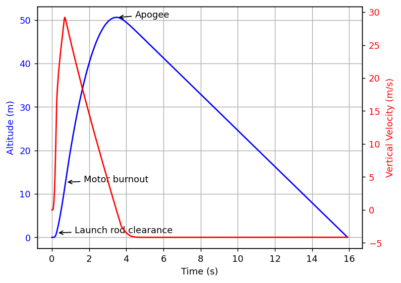

# orhelper

**Script and automate [OpenRocket](https://openrocket.info) from Python.**

Load a `.ork` file, change the rocket or the launch conditions, run simulations, and get the results back
as NumPy arrays. Use it for parameter sweeps, optimisation, Monte Carlo landing-zone studies, or your own
plots.

{ width="520" }

```python
import orhelper
from orhelper import FlightDataType

with orhelper.OpenRocketInstance(log_level="ERROR") as instance:
    helper = orhelper.Helper(instance)

    document = helper.load_doc(orhelper.sample_ork_path())  # or "my_rocket.ork"
    simulation = document.getSimulation(0)
    helper.run_simulation(simulation)

    data = helper.get_timeseries(simulation, [FlightDataType.TYPE_TIME, FlightDataType.TYPE_ALTITUDE])
    print(f"Apogee: {data[FlightDataType.TYPE_ALTITUDE].max():.0f} m")
```

## Where to go next

- **New here?** [Install orhelper](installation.md) and run the [quickstart](quickstart.md).
- **Want to understand how it works?** Read [How orhelper works](guide/concepts.md), then
  [Running simulations](guide/simulations.md).
- **Looking for something specific?** The [examples](examples.md), the [API reference](reference/api.md)
  and the list of [flight data variables](reference/flight-data.md) cover the details.
- **Something not working?** See [Troubleshooting](troubleshooting.md).

## Good to know

- orhelper works with OpenRocket **22.02, 23.09, 24.12 and 26.xx** (see [OpenRocket versions](reference/versions.md)).
- It starts OpenRocket's own Java code inside your Python process, with
  [JPype](https://jpype.readthedocs.io). orhelper adds helpers for the common tasks; everything else is
  OpenRocket's Java API, which you call directly.
- The source is on [GitHub](https://github.com/openrocket/orhelper) and released under the
  [GNU General Public License v2](https://github.com/openrocket/orhelper/blob/master/LICENSE).
